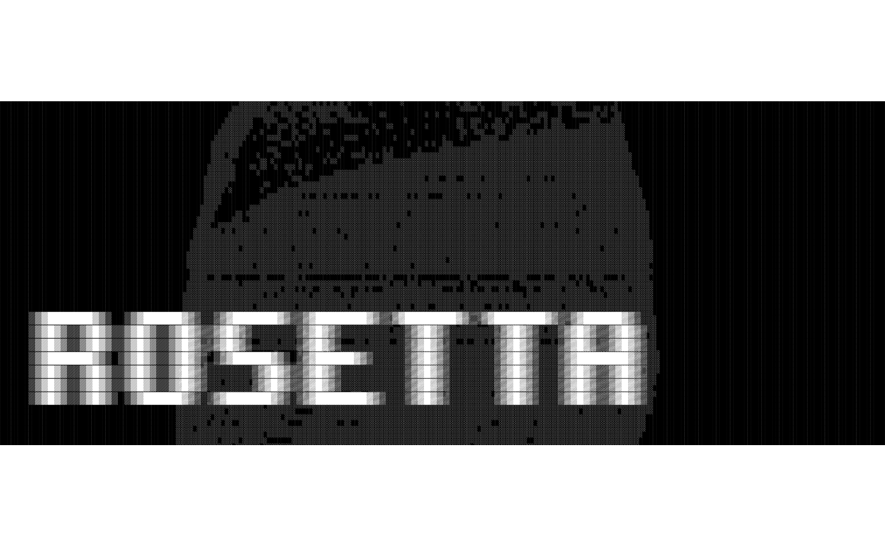

# Rosetta



Modern Rust CLI tool for translating iOS `.xcstrings` files using multiple AI providers with clean terminal interface.

## Features

- **Blazing Fast**: Written in Rust for maximum performance
- **Clean Interface**: Minimalist terminal UI inspired by modern CLI tools  
- **Multi-Provider Support**: 
  - OpenAI (GPT-4, GPT-3.5)
  - Anthropic Claude
  - Google Gemini
  - Grok
- **iOS Native**: Specifically designed for iOS `.xcstrings` localization files
- **Interactive Mode**: Choose what to translate with real-time feedback
- **Batch Processing**: Translate multiple keys at once with progress tracking
- **Auto-Backup**: Automatically backs up your files before translation
- **Smart Detection**: Auto-detects project structure and files
- **Multi-Language**: Supports 12+ languages including CJK languages

## Quick Start

### Installation via Homebrew (Recommended)

```bash
# Add the tap
brew tap hwangdev97/tools

# Install the tool
brew install rosetta
```

### Build from Source

```bash
# Clone the repository
git clone https://github.com/hwangdev97/Rosetta.git
cd rosetta

# Make build script executable and run it
chmod +x build.sh
./build.sh

# Or build manually
cargo build --release
```

### Install via Cargo

```bash
cargo install --git https://github.com/hwangdev97/Rosetta.git
```

## Usage

### Basic Usage

```bash
# Run initial setup to configure AI provider
rosetta setup

# Show current configuration
rosetta config

# Test AI provider connection
rosetta test

# Translate to Japanese
rosetta translate -l ja

# Translate with specific project path
rosetta translate -l zh-Hans -p /path/to/project
```

### Example Output

```
Rosetta
Modern CLI tool for .xcstrings translation

• Auto-detecting project file...
✓ Found: ./Shared/Resources/Localizable.xcstrings
• Initializing translator...
• Loading localization file...
• Creating backup...
✓ Backup: ./Shared/Resources/Localizable.xcstrings.backup_20240626_143052

Translation Task
  Target: ja
  Mode: Supplement (skip existing)
  Keys: 25

Translation Progress
  Status: 1/25 keys
  Progress: 4%

Key:
  Good morning, how are you today?

Action
❯ Translate
  Mark as no translation needed
  Batch translate next 30
  Skip
  Save and exit
```

### Advanced Options

```bash
rosetta translate [OPTIONS]

Options:
  -l, --language <LANG>    Target language code (ja, zh-Hans, zh-Hant, ko, fr, de, es, etc.)
  -p, --path <PATH>        Path to project directory (auto-detected if not specified)
  -h, --help              Print help
  -V, --version          Print version

Commands:
  translate    Translate your iOS strings files
  setup       Run initial setup and configuration
  config      Show current configuration
  test        Test connection with AI provider
  help        Print this message or help for subcommands
```

## 🌐 Supported Languages

| Code | Language | Code | Language |
|------|----------|------|----------|
| `ja` | Japanese | `fr` | French |
| `zh-Hans` | Simplified Chinese | `de` | German |
| `zh-Hant` | Traditional Chinese | `es` | Spanish |
| `ko` | Korean | `pt` | Portuguese |
| `it` | Italian | `ru` | Russian |
| `ar` | Arabic | `hi` | Hindi |

## 🔧 Setup

### 1. Configure AI Provider

1. Run setup command:
```bash
rosetta setup
```

2. Choose your preferred AI provider:
- OpenAI (requires API key from [OpenAI](https://platform.openai.com))
- Claude (requires API key from [Anthropic](https://anthropic.com))
- Gemini (requires API key from [Google AI Studio](https://makersuite.google.com))
- Grok (requires API key from [Grok](https://grok.x))

3. Select your preferred model and enter your API key

### 2. Project Structure

The tool automatically detects your iOS project structure:

```
YourProject/
├── Shared/
│   └── Resources/
│       └── Localizable.xcstrings  # ← Auto-detected
└── ...
```

Or specify custom path with `-p` option.

## 💡 Translation Modes

### Supplement Mode (Default)
- Only translates missing keys
- Skips existing translations
- Perfect for adding new languages

### Fresh Mode
- Retranslates all keys
- Overwrites existing translations  
- Useful for improving translation quality

## 🎯 Interactive Features

### Individual Key Translation
- View original text and existing translations
- Choose to translate, skip, or mark as no-translation-needed
- Edit translations before saving
- Real-time progress tracking

### Batch Translation
- Translate multiple keys at once
- Beautiful progress bars with ETA
- Automatic rate limiting
- Periodic auto-save

### Smart Detection
- Auto-detects project structure
- Skips keys marked as non-translatable
- Handles formatting placeholders correctly

## 📊 Performance

- ⚡ **Fast startup** time
- 🚀 **Efficient** batch processing
- 💾 **Minimal dependencies**
- 🔋 **Low memory** usage

## 🧪 Testing

Run the test suite:

```bash
# Run all tests
cargo test

# Run specific test
cargo test test_config_default

# Run tests with output
cargo test -- --nocapture
```

Test coverage includes:
- Unit tests for each module
- Integration tests
- API provider tests
- Configuration management tests

## 🤝 Contributing

1. Fork the repository from [hwangdev97/Rosetta](https://github.com/hwangdev97/Rosetta)
2. Create your feature branch (`git checkout -b feature/amazing-feature`)
3. Commit your changes (`git commit -m 'Add amazing feature'`)
4. Push to the branch (`git push origin feature/amazing-feature`)
5. Open a Pull Request

## 📝 License

This project is licensed under the MIT License - see the [LICENSE](LICENSE) file for details.

## 🙏 Acknowledgments

- [OpenAI](https://openai.com) for GPT models
- [Anthropic](https://anthropic.com) for Claude
- [Google](https://ai.google.dev) for Gemini
- [xAI](https://grok.x) for Grok
- The Rust community for amazing crates

---

Vibe coding with cursor 🧑‍💻 by [Hwang](https://hwang.fun)